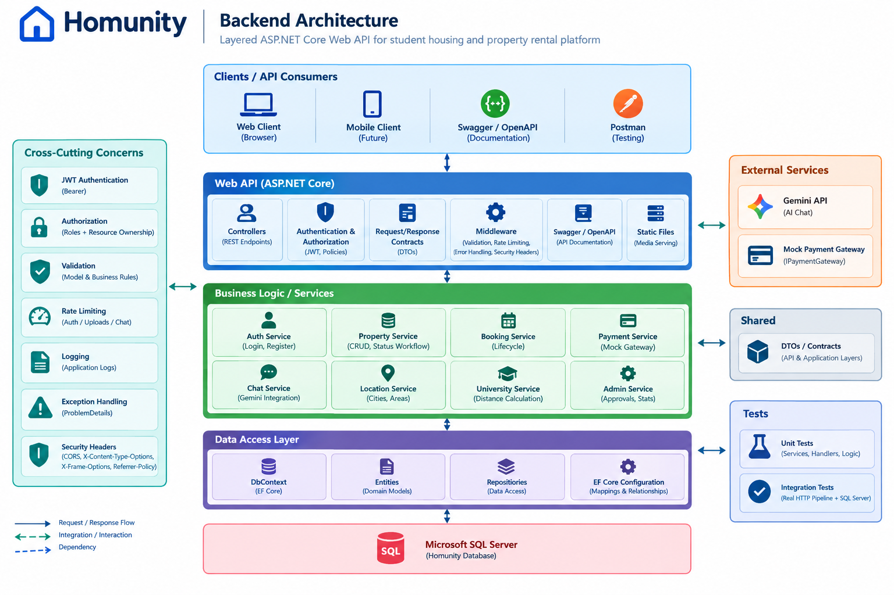
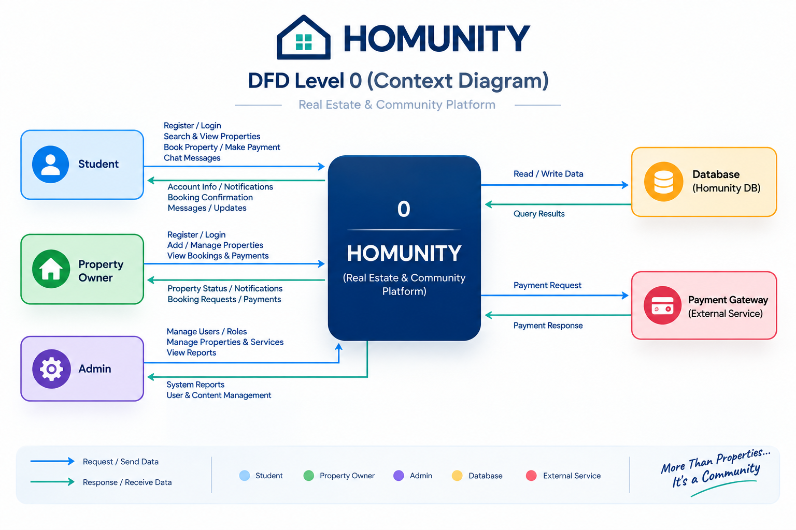
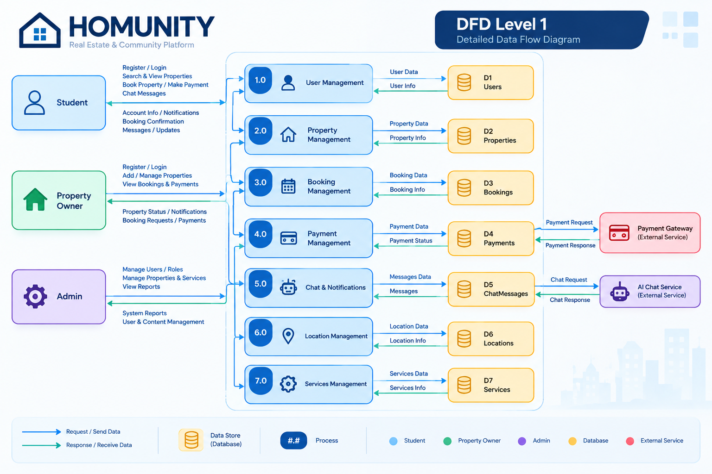
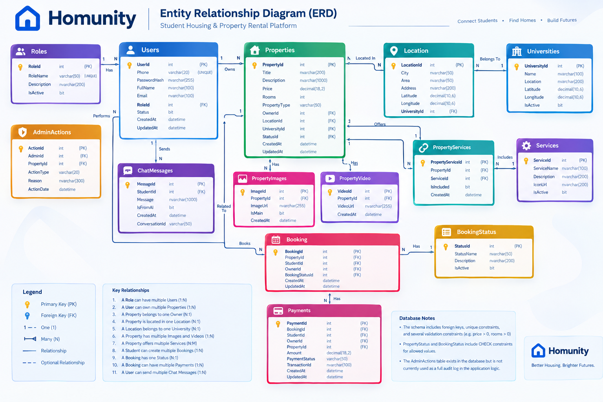
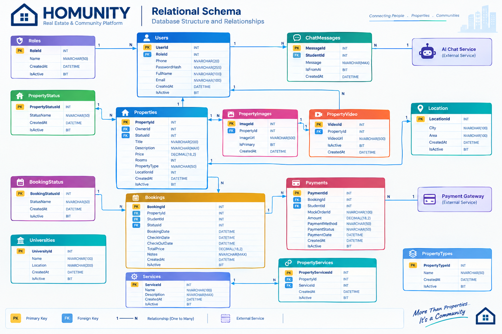
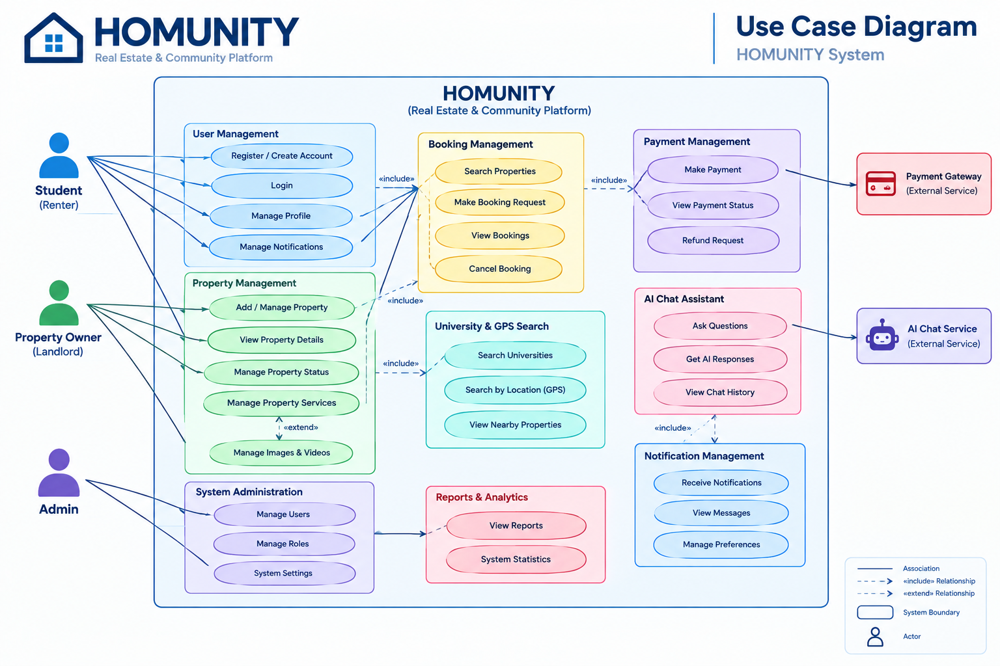

# Homunity Backend

[🔗 Postman Collection](Homunity_Postman_Collection.json)  
[🔗 Live Swagger](https://homunityapiv1.runasp.net/swagger/index.html)  


ASP.NET Core Web API for a student-housing and property-rental platform that connects students with property owners and supports property management, search, booking, administration, payments simulation, and AI-assisted chat.

## Project Overview

Homunity is designed around a real-world rental workflow rather than a simple CRUD API. The backend handles authenticated users, property listings, media, location and university search, booking lifecycle, administrator review, simulated payments, and Gemini-backed chat.

The backend follows a layered structure:

```text
Client / Swagger / Postman
          |
          v
     ASP.NET Core API
          |
          v
 Business Logic / Services
          |
          v
 Data Access / Repositories
          |
          v
      SQL Server
```

Cross-cutting concerns such as JWT authentication, authorization, validation, rate limiting, logging, centralized error handling, and API documentation are handled at the API/application level.

### Architecture Diagram



## Key Features

- JWT Bearer authentication
- BCrypt password hashing
- Role-based authorization for `Admin`, `Owner`, and `Student`
- Resource/ownership authorization for protected user-owned resources
- Property creation, update, deletion, listing, and pagination
- Property images and video management
- Property services/amenities
- Location and university association
- Search by city, area, and maximum price
- University-based search with server-side distance calculation
- Booking request, confirmation, and cancellation workflow
- Administrator approval/rejection of properties
- Dashboard statistics and administrative property views
- Mock payment gateway with order and payment status flow
- Gemini-backed student chat with persisted conversation history
- ProblemDetails-based error responses and centralized exception handling
- Configurable rate limiting for authentication, uploads, and chat
- Unit and integration testing
- Swagger / OpenAPI documentation

## Architecture

The solution is intentionally layered instead of introducing unnecessary architectural complexity.

### 1. Web API

`Homunity Web_Api` contains:

- REST controllers
- HTTP request/response contracts
- JWT authentication configuration
- authorization policies and resource ownership handler
- Swagger/OpenAPI configuration
- rate limiting
- centralized exception handling
- static media serving
- security headers

Controllers depend on application/business services rather than directly coordinating database operations.

### 2. Business Logic

`Homunity_Buisness Logic` contains application services and domain-oriented rules, including:

- authentication and JWT creation
- password hashing
- property workflows
- booking workflows
- payment orchestration
- Gemini client integration
- chat orchestration
- admin operations
- location and university logic
- reference-data services
- application exceptions and policies

### 3. Data Access

`Homunity_Data Access` contains:

- Entity Framework Core `DbContext`
- database entities
- EF Core mappings/configuration
- repositories
- database queries and persistence operations

Primary data access is implemented with Entity Framework Core and SQL Server. Legacy ADO.NET `cls*` data-access classes are not part of the current architecture.

### 4. Shared DTOs

`Shared` contains DTOs and response contracts grouped by domain so that the API and application layers use explicit request/response models.

### 5. Tests

`Homunity.Tests` contains both unit tests and integration tests. Integration tests exercise the actual ASP.NET Core pipeline through `WebApplicationFactory` and use a local SQL Server database rather than an in-memory EF provider.

## Documentation & Diagrams

The repository includes the main system documentation and design diagrams under `docs/`.

### System Architecture


### System Diagrams

<details>
<summary>DFD Level 0</summary>



</details>

<details>
<summary>DFD Level 1</summary>



</details>

<details>
<summary>ER Diagram</summary>



</details>

<details>
<summary>Relational Schema</summary>



</details>

<details>
<summary>Use Case Diagram</summary>



</details>

## API Testing

- **Swagger / OpenAPI:** [Live Swagger](https://homunityapiv1.runasp.net/swagger/index.html)
- **Postman Collection:** [Homunity_Postman_Collection.json](Homunity_Postman_Collection.json)  
  Uses `https://homunityapiv1.runasp.net` as the collection `baseUrl`.

## Technology Stack

| Area | Technology |
|---|---|
| Language | C# |
| Runtime | .NET 8 |
| API | ASP.NET Core Web API |
| ORM | Entity Framework Core 8 |
| Database | Microsoft SQL Server |
| Authentication | JWT Bearer |
| Password Hashing | BCrypt.Net-Next |
| Authorization | Roles + Resource Ownership Policies |
| API Documentation | Swagger / OpenAPI |
| AI Integration | Gemini API via typed `HttpClient` |
| Payments | Mock gateway through `IPaymentGateway` |
| Testing | xUnit, Moq, ASP.NET Core `WebApplicationFactory` |
| Test Coverage Tooling | Coverlet collector |

## Authentication & Authorization

### Authentication

Users authenticate with phone number and password through:

```http
POST /api/Auth/Login
```

A successful login returns a JWT access token containing the user identity and role information.

Passwords are stored as BCrypt hashes. The current authentication implementation also supports migration of legacy SHA256 password hashes to BCrypt during successful authentication.

### Roles

The system uses three application roles:

- `Admin`
- `Owner`
- `Student`

Public registration is restricted to non-admin roles.

### Resource Ownership

Role checks are supplemented by resource-level authorization. Protected operations can verify that the authenticated user owns the referenced resource, while administrators can be allowed through the shared resource-ownership policy.

This is used for operations such as user-owned bookings, chat history, property ownership, and other protected resources.

## Core Business Workflows

### Property Workflow

Owners create listings that can include:

- title and description
- price
- room count
- property type
- coordinates/address
- university association
- images
- video
- services/amenities

Properties participate in an approval workflow:

```text
Pending -> Approved
Pending -> Rejected
```

Only valid status transitions are accepted by the application policy.

### Booking Workflow

A typical booking flow is:

```text
Student requests booking
        |
        v
     In-Process
        |
        v
Owner confirms booking
        |
        v
     Confirmed
        |
        v
Payment is processed
        |
        v
      Booked
```

Students can also cancel eligible bookings. Ownership checks prevent users from acting on bookings that do not belong to them.

### Payment Workflow

Payment is intentionally simulated through a mock gateway rather than a real payment provider.

```text
Confirmed Booking
       |
       v
Create Mock Order
       |
       v
Process Payment
       |
       v
Update Payment / Booking State
```

The abstraction is based on `IPaymentGateway`, with `MockPaymentGateway` providing the current implementation.

> This project does not claim to process real financial transactions.

## Search & Location

The property search layer supports:

- city filtering
- area filtering
- optional maximum price
- pagination and sorting
- university-based search
- optional maximum distance from a university

University distance is calculated server-side using a Haversine-based calculation and returned as part of the university search response.

Representative endpoints:

```http
GET /api/Properties/Search?city=&area=&maxPrice=
GET /api/Properties/SearchByUniversity?universityId=&maxPrice=&maxDistanceKm=
GET /api/Properties/SearchByUniversityNearby?universityId=&maxDistanceKm=&maxPrice=
```

All property search endpoints require authentication.

## Gemini AI Integration

The backend exposes an AI-assisted chat experience for students.

```text
ChatController
     |
     v
  ChatService
     |
     v
 IGeminiClient
     |
     v
  Gemini API
```

The chat layer can use persisted conversation history and property/university context when preparing the request sent to Gemini.

The integration uses a typed `HttpClient` and handles common external API failures such as timeout, network failure, unsuccessful HTTP responses, and invalid response payloads.

Chat endpoints are rate-limited to reduce abuse and uncontrolled external API usage.

## API Overview

The API is organized by functional domain.

| Domain | Representative Routes |
|---|---|
| Authentication | `POST /api/Auth/Login` |
| Users | `POST /api/Users/Register`, profile/status operations |
| Properties | `/api/Properties/*` |
| Property Images | `/api/PropertyImages/*` |
| Property Video | `/api/PropertyVideo/*` |
| Bookings | `/api/Booking/*` |
| Payment | `POST /api/Payment/create-order/{bookingId}`, `POST /api/Payment/process`, `GET /api/Payment/status/{bookingId}` |
| Admin | `/api/AdminActions/*` |
| Chat | `POST /api/Chat/message`, `GET /api/Chat/history/{studentId}`, `DELETE /api/Chat/clear/{studentId}` |
| Locations | `/api/Location/*` |
| Universities | `/api/Universities/*` |
| Services | `/api/Services/*` |
| Roles | `/api/Roles/*` |
| Booking Status | `/api/BookingStatus/*` |

Swagger/OpenAPI is the authoritative way to inspect the complete endpoint surface, request models, response contracts, and authorization requirements.

## Representative API Usage

### Login

```http
POST /api/Auth/Login
Content-Type: application/json

{
  "phone": "01000000000",
  "password": "YourPassword"
}
```

Use the returned JWT as:

```http
Authorization: Bearer <token>
```

### Get paginated properties

```http
GET /api/Properties/GetAllV2?pageNumber=1&pageSize=10&sortBy=Price&sortDescending=false
Authorization: Bearer <token>
```

### Create a booking

```http
POST /api/Booking?PropertyId=1&StudentId=10
Authorization: Bearer <student-token>
```

For the complete endpoint surface, request contracts, response models, authorization requirements, and multipart media examples, use the [Live Swagger](https://homunityapiv1.runasp.net/swagger/index.html).

## Database

The current SQL schema is maintained in:

```text
Database_Script/sql.sql
```

Important database areas include:

- `Users`
- `Roles`
- `Properties`
- `PropertyStatus`
- `PropertyImages`
- `PropertyVideo`
- `PropertyServices`
- `Services`
- `Location`
- `Universities`
- `Booking`
- `BookingStatus`
- `Payments`
- `ChatMessages`
- `AdminActions`

The schema includes foreign keys, uniqueness constraints, and several database-level validation constraints for property and booking data.

## Project Structure

The application project structure remains unchanged; the repository now also includes the new `docs/` documentation folder.

```text
Homunity/
│
├── Homunity Web_Api/
│   ├── Controllers/
│   ├── Authorization/
│   ├── Contracts/
│   ├── Program.cs
│   ├── appsettings.json
│   └── wwwroot/
│
├── Homunity_Buisness Logic/
│   ├── Services/
│   ├── Exceptions/
│   ├── GeminiClient.cs
│   ├── PasswordHasher.cs
│   └── Payment abstractions / implementations
│
├── Homunity_Data Access/
│   ├── Data/
│   ├── Entities/
│   ├── Repositories/
│   └── EF Core configuration
│
├── Shared/
│   └── Domain-based DTOs and response models
│
├── Homunity.Tests/
│   ├── Unit/
│   └── Integration/
│
├── Database_Script/
│   └── sql.sql
│
├── Homunity_Postman_Collection.json
│
└── docs/
    ├── Architecture/
    │   └── System-Architecture.png
    └── Diagrams/
        ├── DFD-Level-0.png
        ├── DFD-Level-1.png
        ├── ER-Diagram.png
        ├── Relational-Schema.png
        └── Use-Case-Diagram.png
```

> The folder name `Homunity_Buisness Logic` reflects the current project name in the source tree.

## Configuration

The API expects sensitive configuration to come from User Secrets or environment variables.

Required settings include:

```text
ConnectionStrings:HomunityDb
Jwt:Key
Jwt:Issuer
Jwt:Audience
Jwt:ExpiryMinutes
```

Gemini chat requires:

```text
Gemini:ApiKey
Gemini:ApiUrl
```

Example configuration shape:

```json
{
  "ConnectionStrings": {
    "HomunityDb": "..."
  },
  "Jwt": {
    "Key": "...",
    "Issuer": "HomunityAPI",
    "Audience": "HomunityClient",
    "ExpiryMinutes": 60
  },
  "Gemini": {
    "ApiKey": "...",
    "ApiUrl": "..."
  }
}
```

Do not commit real database credentials, JWT signing keys, or Gemini API keys.

## Running Locally

### Prerequisites

- .NET 8 SDK
- SQL Server
- A local `Homunity` database created from `Database_Script/sql.sql`
- User Secrets or equivalent environment variables configured for the API

### 1. Restore dependencies

From the solution directory:

```bash
dotnet restore
```

### 2. Configure secrets

Configure `ConnectionStrings:HomunityDb` and `Jwt:Key` for the `Homunity Web_Api` project using User Secrets or environment variables.

For Gemini chat, also configure `Gemini:ApiKey` and `Gemini:ApiUrl`.

### 3. Start the API

```bash
cd "Homunity Web_Api"
dotnet run
```

The development launch settings expose Swagger on the local HTTPS profile at:

```text
https://localhost:7089/swagger
```

The HTTP profile is also configured for:

```text
http://localhost:5118/swagger
```

### 4. Authenticate through Swagger

1. Register a `Student` or `Owner` account.
2. Log in through `POST /api/Auth/Login`.
3. Copy the returned JWT.
4. Use Swagger's **Authorize** button with:

```text
Bearer <token>
```

5. Call protected endpoints.

## Testing

The project contains both unit and integration tests.

### Unit tests

Unit tests isolate application components such as:

- password hashing
- JWT generation
- authorization handler behavior
- service logic
- payment behavior
- Gemini client behavior
- property status policy
- response mappings

### Integration tests

Integration tests use `WebApplicationFactory<Program>` and exercise the real HTTP pipeline, including authentication/authorization and property flows.

The current integration suite uses a local SQL Server database. It does not use EF Core's InMemory provider.

Run all tests with:

```bash
dotnet test
```

## Error Handling

The API uses centralized exception handling and `ProblemDetails` responses.

Application exceptions are mapped to HTTP responses such as:

- `400 Bad Request` for validation failures
- `401 Unauthorized` for authentication failures
- `403 Forbidden` for authorization failures
- `404 Not Found` for missing resources
- `409 Conflict` for application conflicts
- `500 Internal Server Error` for unexpected failures

Development responses may include additional exception detail; production behavior suppresses internal exception details.

## Rate Limiting

The API currently defines dedicated rate-limiting policies for high-risk or externally dependent operations:

| Policy | Current Limit |
|---|---|
| Authentication | 10 requests per minute per client IP |
| Uploads | 20 requests per minute |
| Chat | 15 requests per minute |

Requests rejected by the limiter receive HTTP `429 Too Many Requests`.

## Deployment

The backend is deployed and available through the public API host.

- **API:** https://homunityapiv1.runasp.net/
- **Swagger:** https://homunityapiv1.runasp.net/swagger/index.html
- **Database:** Microsoft SQL Server

Production secrets and connection strings are supplied through environment configuration rather than committed to the repository.

## Security

Security-related implementation currently includes:

- BCrypt password hashing
- JWT issuer/audience/lifetime/signing-key validation
- role-based authorization
- resource ownership authorization
- rate limiting
- restricted CORS origins from configuration
- centralized error handling
- security response headers such as `X-Content-Type-Options`, `X-Frame-Options`, and `Referrer-Policy`
- configuration-based secrets instead of hard-coded application credentials

Before publishing the repository publicly, verify that all local/test configuration values are non-sensitive and that no real credentials or API keys are committed.

## Portfolio Scope

This repository is focused on the backend. The current portfolio objective is to demonstrate backend engineering through:

- API design
- business logic and workflows
- authentication and authorization
- EF Core and SQL Server data access
- external-service integration
- validation and error handling
- testing
- API documentation

The payment implementation is a simulation, not a production payment processor. The Gemini integration depends on an external API key and configured endpoint.

## Project Contribution

**Role:** Team Leader & Back-End Developer

The backend work covers the API/application architecture, business workflows, data access, authentication/authorization, integrations, validation, testing, and backend-oriented project presentation.

## API Documentation

The primary interactive API documentation is Swagger/OpenAPI.

**Live Swagger:** https://homunityapiv1.runasp.net/swagger/index.html

## API Collection & Swagger

- **Postman Collection:** [Homunity_Postman_Collection.json](Homunity_Postman_Collection.json)
- **Live Swagger:** [https://homunityapiv1.runasp.net/swagger/index.html](https://homunityapiv1.runasp.net/swagger/index.html)
## License

No license file is currently specified in the source snapshot. Add a license explicitly if the repository will be distributed under open-source terms.
